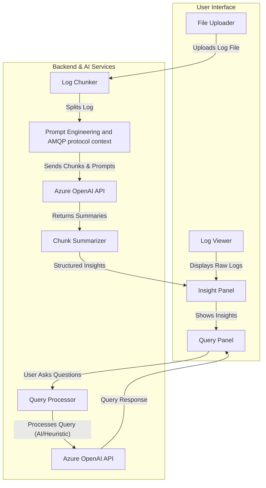

# AMQP Log Analyzer

## Introduction

The AMQP Log Analyzer is a web application designed to provide AI-powered insights for cross-language AMQP logs, such as those generated by Azure Service Bus and Azure Event Hubs SDKs. By leveraging Azure OpenAI, the application enables users to upload large AMQP log files and receive structured, actionable summaries and details, making it easier to understand, debug, and optimize messaging workflows.

## Motivation

AMQP-based messaging systems generate extremely large and complex logs, especially in distributed and high-throughput environments. This results in slow, error-prone, and often infeasible manual analysis, increasing operational costs and delaying resolution of ICMs and user issues. Past ICMs, user issues and stress tests have highlighted the growing scale and complexity of AMQP logs, with files often exceeding hundreds of thousands of lines. Manual analysis is not sustainable, developers have spent hours or days per incident, delaying root cause analysis and impacting customer experience.

Advances in AI and the availability of scalable models (e.g., GPT-4.1) now make automated, high-quality log analysis feasible and cost-effective. The AMQP Log Analyzer leverages AI to automate the extraction of actionable insights, enabling teams to quickly diagnose issues, reduce investigation time, and improve operational efficiency. This solution directly enhances developer productivity for teams working with such logs, and helps us meet SLAs and deliver a better customer experience.

## Project Goals

- Enable users to analyze large AMQP log files efficiently.
- Provide AI-generated summaries and detailed insights for each logical chunk of the log.
- Support natural language queries about the logs.
- Offer a responsive, interactive UI for exploring log data.

## Current Scope and Capabilities

- Upload and view raw AMQP log files in the browser.
- Log file is split into manageable chunks and sent to Azure OpenAI for analysis.
- Each chunk is summarized with its purpose and key events/errors in a structured format.
- Expandable UI for exploring chunk and subchunk insights.
- Query panel for asking questions about the logs in natural language.
- Dynamic, real-time rendering as logs are analyzed.
- Support for multiple log formats and comparison of logs from different SDKs/languages.

## Workflow / Architecture

- The application is built with React and TypeScript.
- Uses Azure OpenAI via @azure-rest/ai-inference for chunk analysis.
- Log chunking is optimized for API limits (e.g., 32K/1M token models).
- Insights are rendered in a tree structure for easy navigation.
- Architecture is extensible to other log types or protocols in the future.
  

## Benefits and Impact

- Reduces incident analysis time for large AMQP logs by 50% or more, saving developer hours and reducing downtime.
- Makes AMQP logs accessible to non-experts via natural language queries, broadening the tool's impact across support, SRE, and engineering teams, and can potentially be offered to customers in the future.
- Enables rapid feedback and iteration during incident investigations, improving customer satisfaction and helping meet SLAs.
- Supports cross-team collaboration by sharing structured insights, and can be adopted across language teams for broader organizational impact.
- Frees engineering resources for higher-value work, improving overall productivity and reducing operational costs.

## Feedback so far

- Team feedback highlighted excitement about valuable insights from prompt and chunk size tweaks.
- Shared with Richard, Swathi, Jeremy, and Deya; all found the tool promising for real-world AMQP logs. From a test log that Swathi shared, we were excited to see it provide actionable insights from simple tweaking of the prompts and chunk sizes!
  

## Future Enhancements / Next Steps

1. **GenAI Script Integration & Automation**: Integrate with GenAI scripts to automate and customize log analysis workflows, including automatic generation of analysis for our stress test logs in CI.
2. **Smarter Chunking & Context Preservation**: Implement log markers (e.g., "azure:" suffix), overlapping windows, and advanced chunking strategies to improve context and reduce API calls.
3. **Cost Optimization**: Batch requests and leverage higher token models (e.g., GPT-4.1 1M tokens) for fewer, larger requests, minimizing API costs.
4. **Advanced Preprocessing & Correlation**: Develop preprocessing to split and tag logs more intelligently, and algorithms for correlating non-consecutive events and errors across large AMQP logs.
5. **Enhanced Cross-Language Support**: Improve comparison and correlation of logs from different SDKs/languages for unified analysis.
6. **Azure SDK MCP Integration**: Connect with Maor's MCP server for deeper Azure insights and automated troubleshooting.
7. **Multi-Frontend & Platform Support**: Enable integration with other UIs and platforms beyond the current React app.
8. **User Experience & Visualization**: Optimize UI for very large logs, add more visualization options, and improve overall usability for AMQP log analysis.
9. **Broader Rollout & Adoption**: Pilot with more teams, collect feedback, and expand usage across the organization.

---

_Prepared: May 1, 2025_
